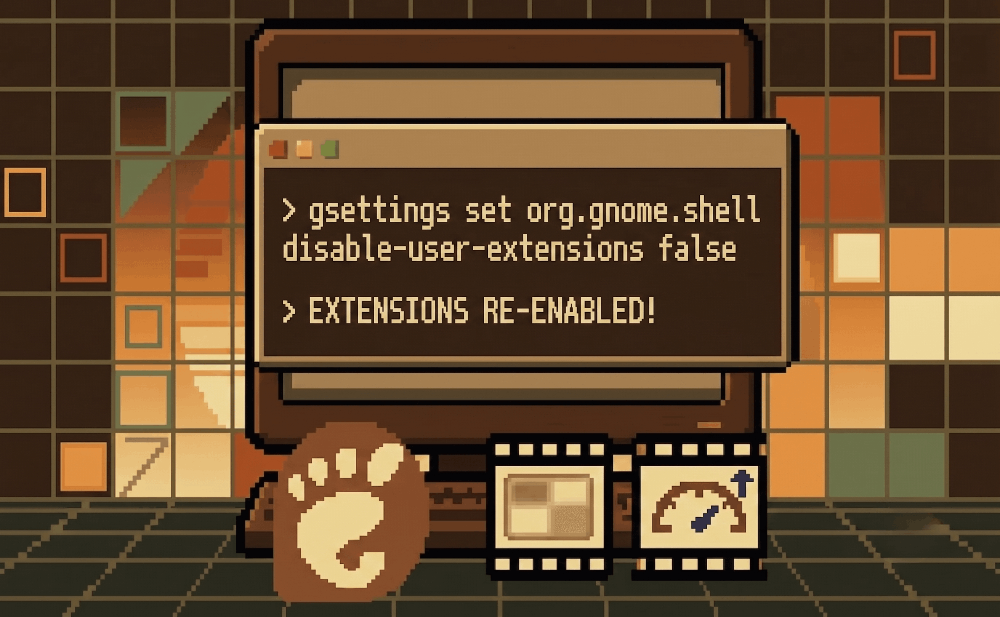
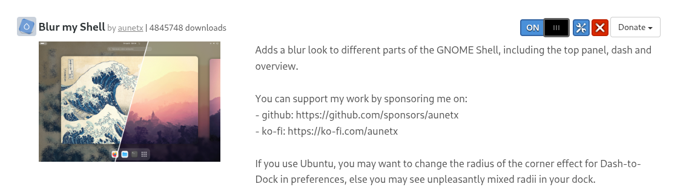
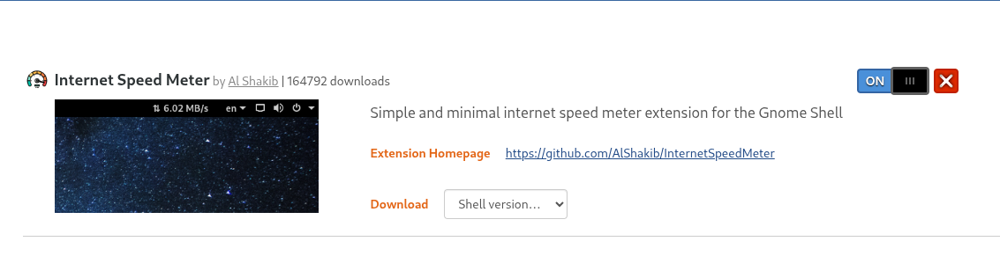
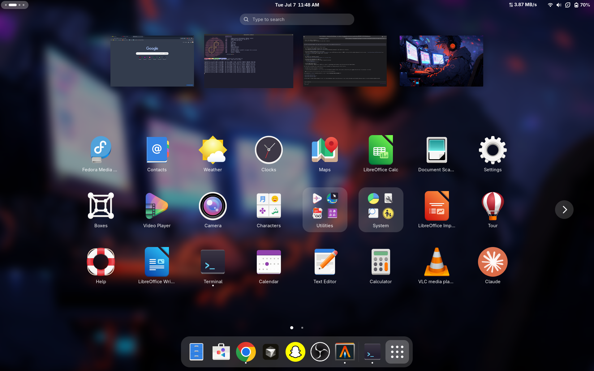

I ran my usual `sudo dnf upgrade -y` to keep my Fedora Workstation up to date. It finished clean, no errors, no warnings. I rebooted, logged back in, and my desktop looked... off. The blur effect on my top panel and dash was gone, and the little speed indicator that always sits quietly telling me my network throughput had vanished too.

<p align="center">
  
</p>

Both extensions I rely on daily — **Blur my Shell** and **Internet Speed Meter** — were just gone, as if I'd never installed them. Since a routine package upgrade had bumped me to a new GNOME Shell version under the hood, I figured the extensions were the casualty. Here's what was actually going on, and how I fixed it.

## Table of contents

## First Clue: The Extensions Were Still "Enabled"

My first instinct was to open the **Extensions** app and check if they'd been disabled. They weren't — both `blur-my-shell@aunetx` and `InternetSpeedMeter@alshakib.dev` still showed up as enabled in GNOME's settings. That was confusing. If they were enabled, why weren't they rendering?

<p align="center">
  
</p>

The extension's own page confirmed it was still toggled **ON**, which ruled out the simplest explanation. Something deeper was blocking them from loading.

## The Real Problem Was Twofold

After digging through GNOME's settings and the actual extension directories, it turned out two separate things had broken at once, both triggered by the upgrade:

1. **User extensions were globally disabled.** The `org.gnome.shell disable-user-extensions` setting had effectively been flipped, which blocks *all* user-installed GNOME Shell extensions regardless of their individual enabled/disabled state. This is a safety mechanism GNOME sometimes trips when a shell version bump happens, since old extensions aren't guaranteed to be compatible with the new shell.
2. **The extension files themselves were missing.** Even though GNOME still listed both UUIDs as installed and enabled, the actual folders under `~/.local/share/gnome-shell/extensions/` weren't there anymore. GNOME had a record that they *should* exist, but nothing to actually load.

So it wasn't one bug, it was a compatibility disable plus a vanished install, stacked on top of each other.

## Checking for a Fedora Package (Spoiler: There Isn't One)

Before manually reinstalling anything, I checked whether Fedora ships these as proper `dnf` packages, since that would make them survive upgrades automatically going forward.

```bash
dnf search gnome-shell-extension-blur
dnf search gnome-shell-extension-internet
dnf search gnome-shell-extension-speed
```

All three searches came back empty. Neither **Blur my Shell** nor **Internet Speed Meter** are packaged in Fedora's repos — they only exist as downloads from extensions.gnome.org, installed per-user. That explains why a system-level `dnf upgrade` doesn't know or care about them at all; they live entirely outside the package manager's view.

<p align="center">
  
</p>

## The Fix, Step by Step

### 1. Re-enable user extensions globally

First, I flipped the global switch back on:

```bash
gsettings set org.gnome.shell disable-user-extensions false
```

This alone wasn't enough, since the extension files were still missing, but it was a necessary first step to make sure GNOME would even attempt to load anything I reinstalled.

### 2. Reinstall the extensions for the new GNOME version

Since my upgrade had moved me to a new major GNOME Shell version, I went back to extensions.gnome.org and grabbed the versions built specifically for that release:

* `blur-my-shell@aunetx`
* `InternetSpeedMeter@alshakib.dev`

Each extension's page lets you pick the exact shell version you need from a dropdown before downloading, which matters — installing a bundle built for the wrong shell version is a fast way to end up right back where I started.

### 3. Restart GNOME Shell to pick up the changes

Reinstalling the files isn't quite the end of it. GNOME Shell needs a fresh start to actually load newly placed extension directories cleanly, so I logged out and back in (a full shell restart) rather than trying to reload extensions in place.

## Back to Normal

After the logout/login, both extensions loaded immediately: the blur was back on my panel and dash, and the speed meter was ticking away in the top bar again like nothing had happened.

<p align="center">
  
</p>
