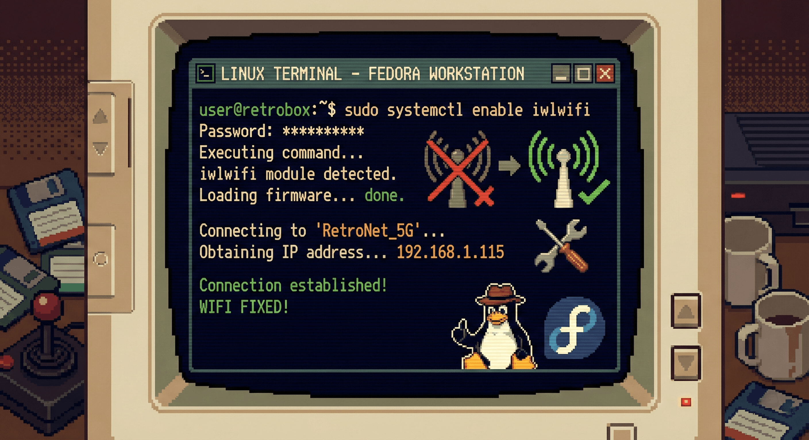

I was working on my Lenovo ThinkPad X13 Yoga Gen 2 running Fedora Linux 43 when suddenly the Wi-Fi disappeared. The settings showed a dreaded message: **"No Wi-Fi Adapter Found"**. What made it even more frustrating was that the hardware was clearly there—I had an Intel Wi-Fi 6 AX201 card installed.



After some investigation, I discovered this was a common issue with Intel AX201 wireless cards on Linux, particularly affecting Fedora users. The driver would work sometimes but fail to initialize properly on boot.

## Table of contents

## Diagnosing the Problem

First, I needed to understand what was actually happening. I ran some diagnostic commands to check if the hardware was detected:

```bash
lspci -nnk | grep -iA3 network
```

Output showed my card was detected:
```
00:14.3 Network controller [0280]: Intel Corporation Wi-Fi 6 AX201 [8086:a0f0] (rev 20)
	Subsystem: Intel Corporation Device [8086:0070]
	Kernel modules: iwlwifi
```

The hardware was there, and the `iwlwifi` driver module was available. So what was the issue?

## The Real Culprit: Driver Initialization Timeout

I checked the kernel messages to see what was happening during boot:

```bash
sudo dmesg | grep -i iwl
```

Buried in the output was the critical error:
```
iwlwifi 0000:00:14.3: probe with driver iwlwifi failed with error -110
```

**Error -110** is a timeout error. The driver was trying to communicate with the Wi-Fi card but couldn't establish a connection within the expected time frame. This is a well-known issue with Intel AX201 cards on Linux systems.

I also verified that the driver module was loaded:

```bash
lsmod | grep -i iwl
# Output:
iwlwifi               589824  0
cfg80211             1544192  1 iwlwifi
```

The module was loaded, but it just couldn't talk to the hardware properly.

## The Temporary Solution That Revealed the Root Cause

At first, I tried reinstalling the firmware:

```bash
sudo dnf reinstall iwl*-firmware
sudo reboot
```

This worked! After the reboot, Wi-Fi appeared and connected successfully. But when I rebooted again, the problem came back. The Wi-Fi would disappear on every other boot.

This intermittent behavior told me something important: the firmware and driver *could* work, but they weren't being initialized properly during the boot process.

## The Permanent Fix: A Multi-Layered Approach

After researching and testing, I found that a combination of solutions was needed to make the Wi-Fi work reliably across all reboots.

### 1. Reinstall the Firmware

First, ensure the Intel wireless firmware is properly installed:

```bash
sudo dnf reinstall iwl*-firmware
```

### 2. Add the Driver to Initramfs

The initramfs (initial RAM filesystem) is loaded early in the boot process. By adding the iwlwifi driver to it, we ensure it's available when the system needs it:

```bash
echo 'add_drivers+=" iwlwifi "' | sudo tee /etc/dracut.conf.d/iwlwifi.conf
sudo dracut -f --regenerate-all
```

### 3. Disable Power Management

The timeout error often occurs because aggressive power management prevents the driver from initializing properly. Disabling power saving for the Wi-Fi module fixes this:

```bash
echo "options iwlwifi power_save=0" | sudo tee /etc/modprobe.d/iwlwifi.conf
```

### 4. Rebuild Initramfs Again

After adding the power management configuration, rebuild the initramfs to include these settings:

```bash
sudo dracut -f --regenerate-all
```

### 5. Create a Systemd Service as a Backup

As an extra layer of reliability, I created a systemd service that forces the driver to reload on every boot:

```bash
sudo tee /etc/systemd/system/iwlwifi-reload.service << 'EOF'
[Unit]
Description=Reload iwlwifi module
After=network-pre.target
Before=network.target

[Service]
Type=oneshot
ExecStart=/usr/sbin/modprobe -r iwlwifi
ExecStart=/usr/sbin/modprobe iwlwifi
RemainAfterExit=yes

[Install]
WantedBy=multi-user.target
EOF

sudo systemctl enable iwlwifi-reload.service
```

### 6. Final Reboot

```bash
sudo reboot
```

## Why This Combination Works

This multi-layered approach ensures Wi-Fi reliability through:

- **Firmware reinstallation**: Ensures the latest Intel AX201 firmware is available
- **Initramfs configuration**: Makes the driver available early in the boot process
- **Power management disabled**: Prevents timeout errors during initialization
- **Systemd service**: Provides a safety net by forcing module reload if other methods fail

The combination handles edge cases across kernel updates, firmware updates, and various boot scenarios.

## Verification

After rebooting, you can verify everything is working:

```bash
# Check if the service is active
systemctl status iwlwifi-reload.service

# Check if power_save is disabled
cat /etc/modprobe.d/iwlwifi.conf

# Verify Wi-Fi adapter is detected
nmcli device status
```

## Conclusion

The Intel Wi-Fi 6 AX201 is an excellent wireless card, but its Linux drivers can be finicky on Fedora. The error -110 timeout issue is frustrating because it's intermittent—sometimes working, sometimes not.

By combining proper initramfs configuration, power management tweaks, and a systemd service fallback, I've achieved reliable Wi-Fi functionality across all reboots. This solution should persist across system updates and kernel changes.

If you're experiencing similar issues with Intel wireless cards on Fedora or other Linux distributions, this comprehensive approach should help you achieve stable Wi-Fi connectivity.
