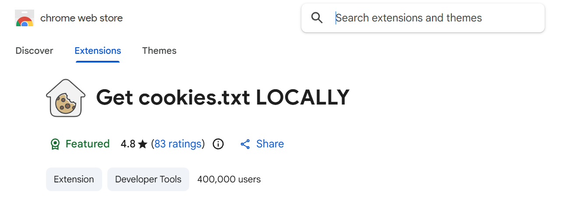

For anyone who loves managing their own media library, **yt-dlp** is the gold standard. It is an incredibly powerful command-line tool that can download video and audio from thousands of sites with surgical precision. Whether you want a specific resolution or just a high-quality MP3, yt-dlp handles it with ease.



However, as platforms like YouTube tighten their security to prevent botting, we often run into "Sign in to confirm you’re not a bot" errors or age-restriction blocks. While yt-dlp has a built-in feature to grab cookies directly from your browser, modern security updates have made this process surprisingly frustrating.

## Table of contents

## The "Database Locked" Headache

Usually, you would try to use your browser's session by adding `--cookies-from-browser edge` to your command. But more often than not, you'll be greeted by this annoying error:

```powershell
Extracting cookies from edge
ERROR: Could not copy Chrome cookie database. See [https://github.com/yt-dlp/yt-dlp/issues/7271](https://github.com/yt-dlp/yt-dlp/issues/7271) for more info

```

This happens because Chromium-based browsers (like Edge, Chrome, and Brave) lock their cookie database file while the browser is open. Even if you close the window, background processes often keep the file "in use," preventing yt-dlp from reading your login session.

## The Solution: Manual Cookie Extraction

The most reliable way to bypass this without constantly closing your browser is to use a cookie export extension. This gives yt-dlp a static "snapshot" of your login session that it can read freely.

### 1. Install the Extension

I use an extension called **"Get cookies.txt LOCALLY"**. It’s lightweight and doesn't send your data to any external servers.

* Install it from the Chrome/Edge Web Store.
* Open YouTube and make sure you are logged in.
* Click the extension icon and export your cookies as a `.txt` file.

### 2. Prepare Your Folder

Save the file (e.g., `cookies.txt`) directly into the folder where you run your commands. In my case, that is `C:\Users\jameel\music`.

### 3. Run the Correct Command

Now, instead of telling yt-dlp to look into the browser, we point it directly to our text file using the `--cookies` flag:

```powershell
yt-dlp --js-runtimes node --remote-components ejs:github --cookies-from-browser chrome -x --audio-format mp3 --audio-quality 0 "media_link_to_be_download"

```

### Why This Works Better

* **No Conflicts:** It doesn't matter if Edge is open, closed, or running 50 tabs; the text file is always accessible.
* **Consistency:** This method works even when browser updates change how internal databases are encrypted.
* **Bypass Captchas:** Since the file contains your actual "logged-in" session, YouTube treats the request as coming from a verified user.

## A Note on Security

Your `youtube_cookies.txt` file is essentially a temporary key to your account. Never share this file with anyone else! Once you are done with your downloads, it is a good habit to delete the text file or move it to a secure location.
